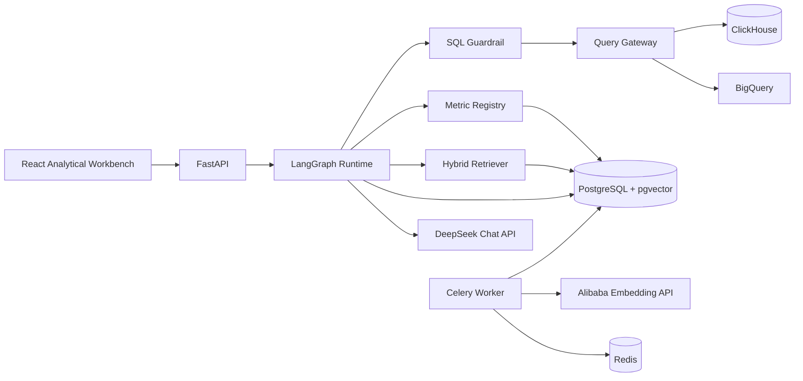

# MetricLens High-Level Design

中文版：[HLD.zh.md](./HLD.zh.md)

## 1. Purpose and boundaries

MetricLens serves internal data analysts who need fast answers without bypassing metric governance.
It is a read-only system: it cannot mutate warehouse data, publish BI assets, or run cross-warehouse
federated joins. A successful answer always exposes its SQL and evidence.

## 2. Component architecture

- **Web:** login, governed chat, result table, SQL viewer, Evidence Rail, and governance catalogs.
- **API:** authentication, conversations, agent streaming, metrics, schemas, knowledge, memory,
  audit, and evaluation contracts.
- **Agent:** fixed authorization → understanding → retrieval → planning → governed execution flow.
- **Control plane:** metric definitions, schema snapshots, data-source connections, vectors, user
  state, audit, and evaluations.
- **Data plane:** local ClickHouse analytics views and an optional BigQuery connector.

## 3. Agent and query flow

1. The API derives user identity from the signed token; identity is never accepted from the model.
2. Metric resolution considers only published definitions visible to the user.
3. Retrieval combines exact names, PostgreSQL full-text results, and pgvector results with RRF.
4. The plan is structured state, not unconstrained chain-of-thought.
5. Metric compilation owns measures, fixed filters, grains, and time dimensions.
6. SQLGlot rejects multiple statements, mutations, and unauthorized tables.
7. ClickHouse runs `EXPLAIN` with a read-only account; BigQuery uses Dry Run and byte limits.
8. Execution enforces runtime and row limits.
9. The response maps every business claim to metric, schema, filter, and execution evidence.

The graph checkpoints at node boundaries. Request state and conversation memory are separate from
long-term user preferences. Organization metrics and schema always override user memory.

## 4. Semantic control plane

### Metrics

Git YAML is authoritative. Published definitions require name, version, description, owner, model,
grain, aggregation, expression, time dimension, allowed dimensions, and tests. PostgreSQL stores a
validated runtime copy with its source hash.

### Schema

Connectors capture source, model, column, type, description, sensitivity, and snapshot hash. A
breaking schema change invalidates dependent metrics before the agent can use them.

### Data sources

Warehouse connections are tenant-scoped control-plane records. Exactly one active source drives
the query gateway for governed execution; secrets are masked in API responses and admin-only
mutation endpoints control creation and activation. The default local source points to the Olist
ClickHouse warehouse, while BigQuery can be registered for production deployments with byte limits.

### Knowledge and embeddings

Metric text, schema descriptions, glossary documents, and confirmed user memories are chunked and
embedded with Alibaba `text-embedding-v4` at 1024 dimensions. Each vector records model, dimension,
content hash, and generation time. Changing model or dimension creates a new index generation.

## 5. Security and isolation

- JWT identity is injected by the API; production replaces demo login with OIDC.
- Every persistent record includes tenant and user scope where appropriate.
- PostgreSQL row-level security is the production enforcement boundary.
- Query identities receive `SELECT` only on approved analytics models.
- SQL is parsed as an AST and restricted to one `SELECT`/`WITH SELECT` statement.
- Secrets enter containers through environment files locally and Secret Manager in production.
- Authorization headers and credentials are redacted from logs.
- Audit events record normalized SQL, evidence, schema version, trace ID, user, and query cost.

## 6. Reliability and observability

- PostgreSQL checkpoints enable node-level recovery.
- Celery jobs use bounded retries and exponential backoff.
- Embeddings use content hashes for idempotency.
- Olist files are validated before import.
- OpenTelemetry traces connect HTTP, graph nodes, model calls, retrieval, and warehouse queries.
- Operational alerts cover provider errors, refusal rate, SQL failures, bytes scanned, and P95 latency.

## 7. Deployment mapping

Docker Compose mirrors production roles: web, API, worker, PostgreSQL/pgvector, Redis, ClickHouse,
migration, and dataset initialization. Production deploys stateless API/worker replicas to
Kubernetes or ECS, uses managed stores, enterprise OIDC, private networking, and centralized secrets.

## 8. Evaluation

`evaluations/olist_core_v1.yaml` expands to at least 60 versioned cases covering metric resolution,
dimensions, bilingual phrasing, ambiguity, and unsafe requests. Release gates include 100% mutation
blocking, zero cross-user leakage, 100% evidence completeness, at least 95% executable SQL, at
least 90% metric resolution, and at least 85% answer correctness.
