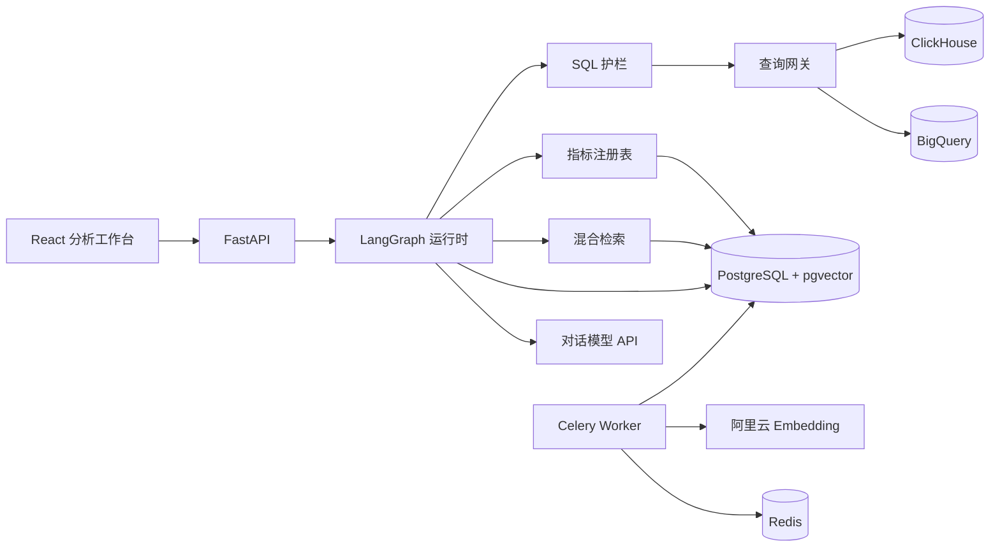

# MetricLens 高层设计（HLD）

> 英文原文：[HLD.md](./HLD.md)

## 1. 定位与边界

MetricLens 面向企业内部分析师：用自然语言快速得到答案，同时不绕过指标治理。

系统是**只读**的：不能改写数仓数据、不能发布 BI 资产、不能做跨仓联邦 JOIN。一次成功回答必须同时给出 **SQL** 和 **证据链**。

## 2. 组件架构

- **Web：** 登录、受治理对话、结果表、SQL 查看、Evidence Rail、治理目录。
- **API：** 鉴权、会话、Agent 流式分析、指标、Schema、知识库、记忆、审计、评测接口。
- **Agent：** 固定流程：鉴权 → 理解 → 检索 → 规划 → 受控执行。
- **控制面：** 指标定义、Schema 快照、数据源连接、向量、用户状态、审计、评测。
- **数据面：** 本地 ClickHouse 分析视图，以及可选的 BigQuery 连接器。

## 3. Agent 与查询流程

1. API 从签名 Token 解析用户身份；**身份绝不来自模型输出**。
2. 指标解析只考虑该用户可见、且已发布（published）的定义。
3. 检索融合：精确名称 + PostgreSQL 全文 + pgvector，再用 RRF 融合。
4. 执行计划是结构化状态，不是无约束思维链。
5. 指标编译负责度量、固定过滤、粒度、时间维度。
6. SQLGlot 拒绝多语句、写入类语句、未授权表。
7. ClickHouse 用只读账号跑 `EXPLAIN`；BigQuery 用 Dry Run 和扫描字节上限。
8. 执行有超时和行数限制。
9. 响应把每条业务结论映射到指标、Schema、过滤条件和执行证据。

图在节点边界做 checkpoint。请求态、会话记忆与长期用户偏好分离。组织级指标和 Schema **始终覆盖**用户记忆。

## 4. 语义控制面

### 指标

Git 中的 YAML 是权威源。已发布定义必须包含：名称、版本、描述、负责人、模型、粒度、聚合、表达式、时间维度、允许维度、测试。PostgreSQL 保存一份校验后的运行时副本及其源 hash。

### Schema

连接器采集来源、模型、列、类型、描述、敏感级、快照 hash。破坏性 Schema 变更会先作废依赖该表的指标，Agent 不能继续使用旧定义。

### 数据源

仓连接是租户范围的控制面记录。同一时刻只有一个**激活数据源**驱动查询网关。密钥在 API 响应中脱敏；创建和激活仅管理员可写。本地默认指向 Olist 的 ClickHouse；生产可注册 BigQuery，并带扫描字节上限。

### 知识与向量

指标文案、Schema 描述、术语表、已确认的用户记忆会被切片，用阿里云 `text-embedding-v4`（1024 维）向量化。每条向量记录模型、维度、内容 hash、生成时间。更换模型或维度会生成新的索引世代。

## 5. 安全与隔离

- JWT 身份由 API 注入；生产环境用企业 OIDC 替换演示登录。
- 持久化记录在合适处带租户和用户范围。
- 生产强制边界是 PostgreSQL 行级安全（RLS）。
- 查询账号对批准的分析模型只有 `SELECT`。
- SQL 按 AST 解析，只允许一条 `SELECT` / `WITH SELECT`。
- 密钥本地走环境文件，生产走 Secret Manager。
- 日志脱敏 Authorization 头和凭证。
- 审计记录归一化 SQL、证据、Schema 版本、trace ID、用户、查询成本。

## 6. 可靠性与可观测性

- PostgreSQL checkpoint 支持节点级恢复。
- Celery 任务有限次重试和指数退避。
- Embedding 用内容 hash 保证幂等。
- Olist 文件导入前校验。
- OpenTelemetry 把 HTTP、图节点、模型调用、检索、仓查询串成一条 trace。
- 告警覆盖：模型供应商错误、拒答率、SQL 失败、扫描字节、P95 延迟。

## 7. 部署映射

Docker Compose 镜像生产角色：web、API、worker、PostgreSQL/pgvector、Redis、ClickHouse、迁移、数据集初始化。

生产将无状态 API / worker 副本部署到 Kubernetes 或 ECS，使用托管存储、企业 OIDC、私有网络和集中密钥管理。

## 8. 评测

`evaluations/olist_core_v1.yaml` 展开为至少 60 条版本化用例，覆盖指标解析、维度、中英双语问法、歧义、不安全请求。

发布门槛：

- 写入类语句拦截 **100%**
- 跨用户泄漏 **0**
- 证据完整性 **100%**
- 可执行 SQL ≥ **95%**
- 指标解析 ≥ **90%**
- 答案正确率 ≥ **85%**
